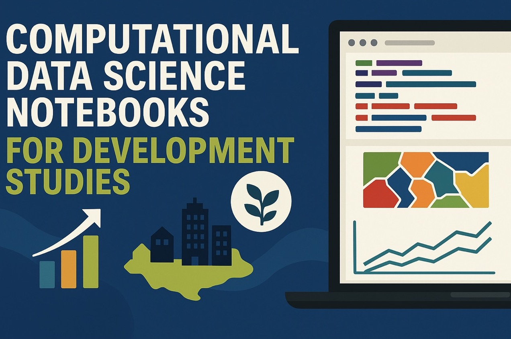

# Data Science for Development Studies

## An Open Collection of Computational Notebooks and Apps

How to cite this project:

> Mendez C. (2026) *Data Science for Development Studies: An Open Collection of Computational Notebooks and Apps.* Zenodo. [https://doi.org/10.5281/zenodo.15250204](https://doi.org/10.5281/zenodo.15250204) Website: [https://cmg777.github.io/ds4ds](https://cmg777.github.io/ds4ds)

Contribute and provide feedback at [https://github.com/cmg777/ds4ds](https://github.com/cmg777/ds4ds)

## Basic statistics and econometrics

- Mendez C. (2024) [Gapminder introduction to data science using Python](https://colab.research.google.com/github/cmg777/ds4ds/blob/main/python_gapminder_example.ipynb)
- Mendez C. (2025) [Gapminder introduction to data science using Julia](https://colab.research.google.com/github/cmg777/ds4ds/blob/main/julia_gapminder_example.ipynb)
- Mendez C. (2025) [Introduction to statistical differences and relationships using Python](https://colab.research.google.com/github/cmg777/ds4ds/blob/main/python_real_differences_and_relationships.ipynb)
- Mendez C. (2025) [Statistics is about differences, relationships, and predictions](https://colab.research.google.com/github/cmg777/ds4ds/blob/main/python_statistics_differences_relationships_predictions.ipynb)
- Mendez C. (2024) [Descriptive statistics and multi-boundary mapping using Python](https://colab.research.google.com/github/cmg777/ds4ds/blob/main/python_descriptive_statistics_and_multi_boundary_mapping.ipynb)
- Mendez C. (2025) [Use regressions to explore relationships using Python](https://colab.research.google.com/github/cmg777/ds4ds/blob/main/python_regressions_to_explore_relationships.ipynb)

## Economic growth and development

- Mendez C. (2025) [Introduction to growth equations using Python](https://colab.research.google.com/github/cmg777/ds4ds/blob/main/python_introduction_to_growth_equations.ipynb)
- Mendez C. & Leiva F. (2023) [The Solow growth model and its convergence prediction using Python](https://colab.research.google.com/github/cmg777/ds4ds/blob/main/python_solow_growth_model.ipynb)
- Mendez C. (2023) [The Solow growth model and its convergence prediction using R](https://colab.research.google.com/github/cmg777/ds4ds/blob/main/r_solow_growth_model.ipynb)
- Mendez C. (2021) [Convergence clubs in labor productivity and its proximate sources using R](https://colab.research.google.com/github/cmg777/ds4ds/blob/main/r_convergence_clubs_labor_productivity.ipynb)

## Exploratory data analysis

- Mendez C. (2024) [Exploratory spatial data analysis of municipal development in Bolivia using Python](https://colab.research.google.com/github/cmg777/ds4ds/blob/main/python_esda_municipal_development_bolivia.ipynb)

## Causal inference

- Mendez C. (2025) [Introduction to directed acyclical graphs (DAGs) using R](https://colab.research.google.com/github/cmg777/ds4ds/blob/main/r_introduction_to_DAGs.ipynb)
- Mendez C. (2024) [Heterogeneous treatment effects via two-stage DID using R](https://colab.research.google.com/github/cmg777/ds4ds/blob/main/r_heterogeneous_treatment_effects_DID.ipynb)
- Mendez C. (2025) [Synthetic control explorer: Estimate counterfactuals with weighted combinations of control units](https://cmg777.github.io/open-results/files/synthetic_control_explorer2.html)

## Machine learning

- Mendez C. (2025) [Introductory machine learning for econometrics: Exploring the Mincer equation in Python](https://colab.research.google.com/github/cmg777/ds4ds/blob/main/python_introductory_ml_mincer_equation.ipynb)
- Mendez C. (2025) [An interactive app to learn SHAP plots with XGBoost predictions](https://ai.studio/apps/drive/1AOCpYZvP9S58zBq3Z7mESzeUCk04Z8Bg?fullscreenApplet=true)

## Spatial econometrics

- TBA

## Bayesian econometrics

- TBA

## Feature engineering and geocomputation

- Mendez C. (2025) [Regional dynamics of luminosity-based GDP using Google Earth Engine](https://code.earthengine.google.com/b8a4fa3a96056d220bcb31b6a561cb1e)

## Community

We're using Github Discussions as a place to connect with other members of our community. Join the discussion at [https://github.com/cmg777/ds4ds/discussions](https://github.com/cmg777/ds4ds/discussions)

## Events

Join our public events for training sessions and to design prototype computational notebooks and apps. Events are announced on Luma: [https://luma.com/cmg](https://luma.com/cmg)

## People

**Editor:** Carlos Mendez — Associate Professor, Nagoya University, Japan

**Contributors:** Favio Leiva Cardenas — PhD Student, Nagoya University, Japan
